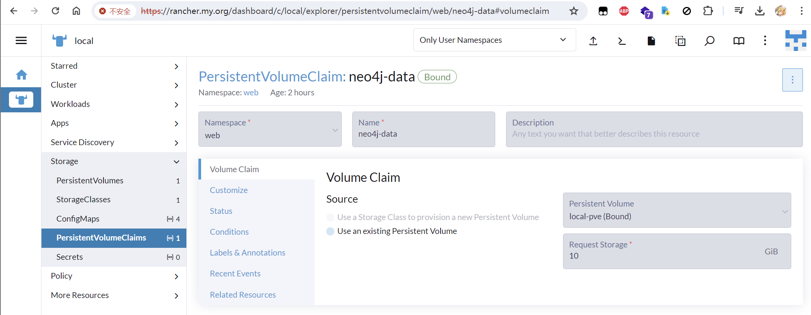

---
tags:
  - k3s
  - rancher
  - pve
  - docker
created: 2024-01-11T20:44
updated: 2024-04-16T12:39
name: Deploy k3s + rancher on PVE container
title: 在 PVE 容器上部署 k3s + rancher
description: "我的家庭服务器方案"
date: 2024-04-15
toc: true
isCJKLanguage: true
image: image-2024_04_16_12_36_53.png
keywords:
  - PVE
  - k3s
  - rancher
---

## 折腾历程

目的本来是实操 `k8s` 的，部署时搞了一堆花里胡哨的，虽然因为复杂度与资源消耗原因放弃了这套方案~~（=白折腾）~~，但对理解 k8s 的组成部分帮助很大。

> 曾经的解决方案：
>
> - 部署工具：kubeadm
> - 容器运行时 CRI： cri-o
> - 容器底层交互接口 OCI ：crun
> - 容器网络 CNI： cilium

不过部署完这套，小鸡性能吃紧，遂换到了 `k3s`。

但将 `k3s` 作为 `HomeServer` 使用一段时间后，手写各种 depolyment yaml 很是折磨，远不比 `docker-compose` 方便，维护工作反而变麻烦了，一度想放弃折腾。

不过心底还是想坚持用 `k8s` ~~(大概是跟风吧）~~，痛点不过是手写 `yaml`，命令行看日志等等琐碎操作，这些问题 `rancher` 都可以解决。~~不过写一些 `k8s` 的 `yaml` 后再用 webui 会很容易上手。~~

> 也有其它的 management，不过 rancher 比较流行，虽然**很重**。轻量一点的也有一个 [GitHub - skooner-k8s.](https://github.com/skooner-k8s/skooner)，没啥资源的家庭服务器感觉可以考虑。

## LXC 前置条件

### 1. LXC 的权限

设置容器 /proc /sys 读写权限、cgroup 权限等

```bash
vim /etc/pve/lxc/{lxc id}.conf

# 放开权限
unprivileged: 0
```

```properties
lxc.apparmor.profile: unconfined
lxc.cgroup.devices.allow: a
lxc.cap.drop:
lxc.mount.auto: "proc:rw sys:rw"
```

### 2. 为容器创建 /dev/kmsg

容器一般不存在 /dev/kmsg 内核日志，`k3s` 大概会向此“文件”输出消息，所以需要保证容器启动后存在这个文件，容器里存在一个 /dev/console，可以用这个“文件”作替身用。

- 自动创建 /dev/kmsg

```bash
vim /usr/local/bin/conf-kmsg.sh
```

```bash
#!/bin/sh -e
if [ ! -e /dev/kmsg ]; then
        ln -s /dev/console /dev/kmsg
fi
mount --make-rshared /
```

- 创建 systemd 开机执行脚本

```bash
vim /etc/systemd/system/conf-kmsg.service
```

```ini
[Unit]
Description=Make sure /dev/kmsg exists
[Service]
Type=simple
RemainAfterExit=yes
ExecStart=/usr/local/bin/conf-kmsg.sh
TimeoutStartSec=0
[Install]
WantedBy=default.target
```

- 启用生效

```bash
chmod +x /usr/local/bin/conf-kmsg.sh
systemctl daemon-reload
systemctl enable --now conf-kmsg
```

## 安装 k3s

- 从官方中国源安装，默认装最新版
- 注意版本号，要与 rancher 兼容

```bash
curl -sfL https://rancher-mirror.rancher.cn/k3s/k3s-install.sh | INSTALL_K3S_MIRROR=cn INSTALL_K3S_VERSION=v1.28.7+k3s1 sh -s - server
```

> 需要安装 rancher 支持的 k3s/k8s 版本。k3s 版本列表：[K3s](https://docs.k3s.io/zh/release-notes/v1.28.X)；
> rancher 兼容表： [Rancher Manager v2.8.3 | SUSE](https://www.suse.com/suse-rancher/support-matrix/all-supported-versions/rancher-v2-8-3/)

## 安装 Rancher

### 1. 安装 Helm

```bash
curl -fsSL -o get_helm.sh https://raw.githubusercontent.com/helm/helm/main/scripts/get-helm-3
chmod 700 get_helm.sh
./get_helm.sh
```

为了使用 Helm，需要 `Kubeconfig` 环境变量

```bash
cat >> /etc/profile << EOF
export KUBECONFIG=/etc/rancher/k3s/k3s.yaml
EOF
source /etc/profile

# 验证一下
helm list -A
```

### 2. Helm 添加仓库

```bash
helm repo add rancher-stable https://releases.rancher.com/server-charts/stable
```

> 国内可以用镜像： `https://rancher-mirror.rancher.cn/server-charts/stable` ，版本可能落后。

### 3. 为 Rancher 创建命名空间

你需要定义一个 Kubernetes 命名空间，用于安装由 Chart 创建的资源。这个命名空间的名称为  `cattle-system`：

```bash
kubectl create namespace cattle-system
```

### 4. rancher 默认需要 SSL 相关配置

需要安装 `cert-manager`

```bash
kubectl apply -f https://github.com/cert-manager/cert-manager/releases/download/v1.13.1/cert-manager.crds.yaml
```

### 5. 部署 rancher

**部署后需要通过 `hostname` 访问 `rancher`**，如果没有 DNS 服务器，应该可以通过修改 `hosts` 文件映射 `ip` 访问。

```bash
helm install rancher rancher-stable/rancher --namespace cattle-system --set hostname=rancher.my.org --set bootstrapPassword=admin --version 2.8.3
```

## 最后部署一个 NEO4J 熟悉一下 rancher（可选）

- 新建个持久化卷资源
  - `PersistentVolumes`
    - `HostPath` 类型
- 再新建个持久化卷请求声明
  - `PersistentVolumeClaims`
    - 选择刚才建立的 `PV`



- 新增 `Deployments`
  - 为 `Pod` 指定 `PVC`
  - 容器镜像：`neo4j:5.19.0`
  - 配置下 `Service`
    - 简单点就先 `NodePort` 了，后面在配 `Ingress`
  - 加个环境变量
    - `NEO4J_AUTH=user/pwd`


- 可以查看日志、服务状态，启动成功后。
  - 访问 Neo4j http://ip:30075 (nodeport 监听的端口)
